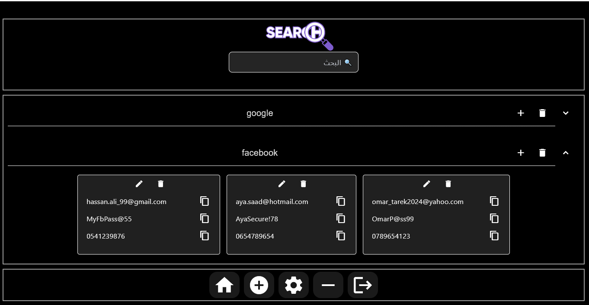
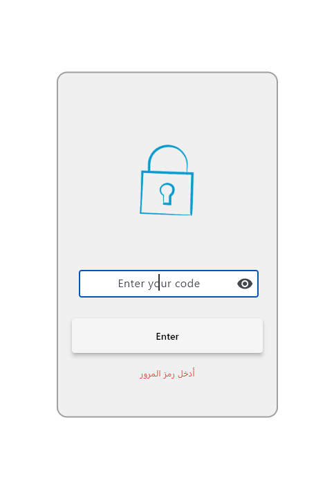
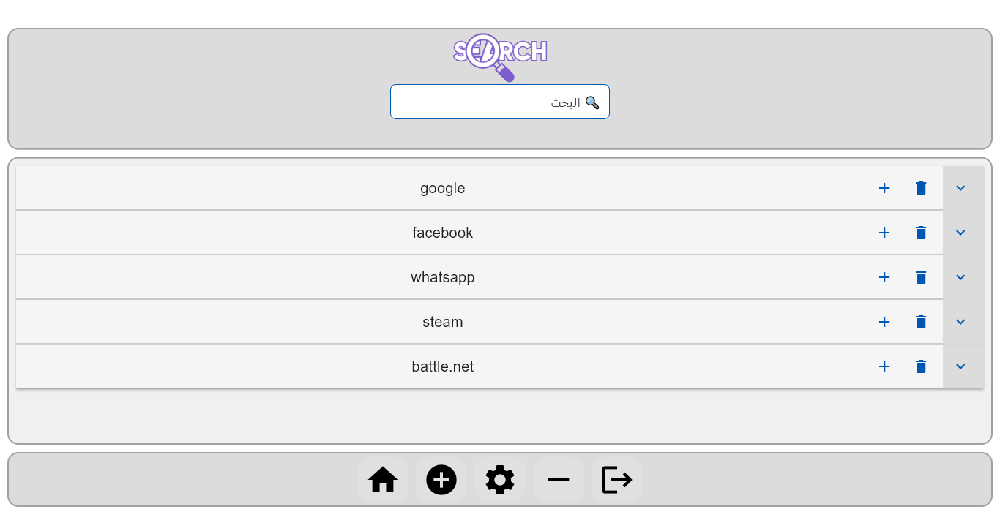
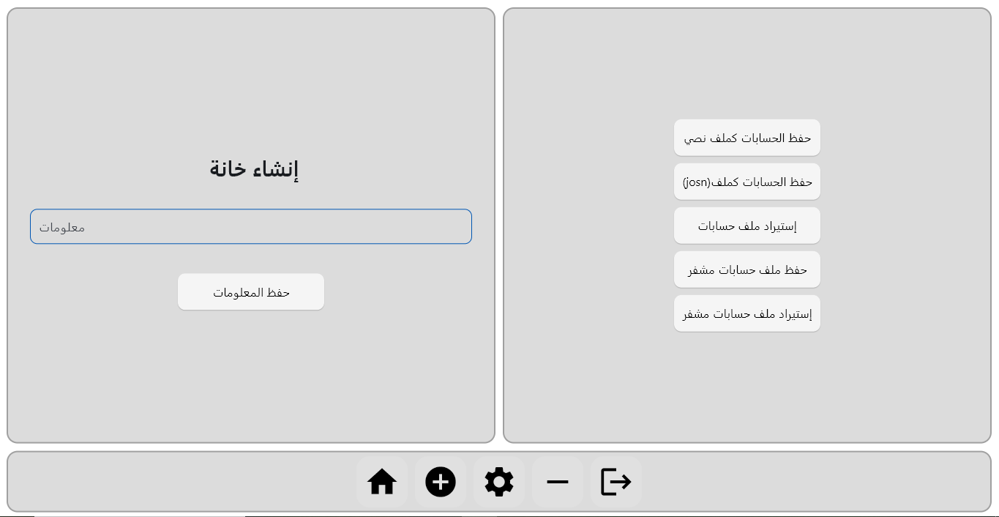

# 🔐 Password Manager - Flet Password Manager

## 📌 Overview
A secure and powerful password manager developed using **Flet**. You can use it to store and manage your accounts easily, with support for **encryption, smart search, and full UI customization**.

## 🚀 Features
- 🔑 **PIN system on first login**: Used as the decryption key for data.
- 📂 **Easily manage accounts**: Create categories (e.g., Google, Facebook) and add accounts inside them.
- ✍️ **Unlimited lines per account**, with a **quick copy button** for each line.
- 🔍 **Smart search that works even with typos**, displaying the closest results.
- ✏️ **Edit data easily**:
  - When renaming a category, the data updates automatically.
  - If the new category does not exist, it is created automatically.
- 💾 **Save data in three formats**:
  - 🔹 **TXT**
  - 🔹 **JSON**
  - 🔹 **Encrypted file**
- 📥 **Import data from all supported formats**.
- 🎨 **Full UI customization** with many options.
- ⚠️ **Warning**: Do not modify the settings unless you know what you are doing, as errors may cause the application to stop working.
- 🖥️ **Windows tray mode support**: You can hide the app to run in the background next to the system clock.

## 🛠️ Requirements
### 📦 Required Libraries:
```bash
pip install flet cryptography pillow pystray
```

## 📥 Installation & Usage
1. Download the appropriate version for your system from [Releases](https://github.com/MohammedBoure/CipherSafe/tags).
2. Extract the file if it is compressed.
3. Run the application and enjoy! 🚀

## 📜 License
This project is open-source and can be freely modified. See the [LICENSE](LICENSE) file for more details.

## 📧 Support & Contribution
If you encounter an issue or have a suggestion, feel free to open an **Issue** in the GitHub repository!

---

# 🔐 مدير كلمات المرور - Flet Password Manager

## 📌 نظرة عامة
مدير كلمات مرور آمن وقوي تم تطويره باستخدام **Flet**. يمكنك استخدامه لتخزين حساباتك وإدارتها بسهولة، مع دعم **التشفير، البحث الذكي، والتخصيص الكامل للواجهة**.

## 🚀 المميزات
- 🔑 **نظام PIN عند الدخول لأول مرة**: يتم استخدامه كمفتاح لفك تشفير البيانات.
- 📂 **إدارة الحسابات بسهولة**: يمكنك إنشاء خانات (مثل Google، Facebook) وإضافة حسابات بداخلها.
- ✍️ **إمكانية إدخال عدد غير محدود من الأسطر لكل حساب**، مع **زر نسخ سريع** لكل سطر.
- 🔍 **بحث ذكي يعمل حتى مع الأخطاء الإملائية**، حيث يعرض أقرب النتائج.
- ✏️ **إمكانية تعديل البيانات**:
  - عند تعديل اسم الخانة، يتم تحديث البيانات تلقائيًا.
  - في حالة عدم وجود خانة بنفس الاسم، يتم إنشاء واحدة جديدة تلقائيًا.
- 💾 **حفظ البيانات بثلاث صيغ**:
  - 🔹 **TXT**
  - 🔹 **JSON**
  - 🔹 **ملف مشفر (Encrypted File)**
- 📥 **استيراد البيانات من جميع الصيغ المدعومة**.
- 🎨 **تخصيص كامل للواجهة** مع العديد من الخيارات.
- ⚠️ **تحذير**: لا تعدّل في الإعدادات إلا إذا كنت تعرف ماذا تفعل، فقد يؤدي ذلك إلى توقف التطبيق.
- 🖥️ **دعم وضع الإخفاء في Windows**: يمكنك إخفاء التطبيق ليعمل في الخلفية بجوار الساعة.

## 🛠️ المتطلبات
### 📦 المكتبات المستخدمة:
```bash
pip install flet cryptography pillow pystray
```

## 📥 التثبيت والتشغيل
1. قم بتحميل النسخة المناسبة لنظامك من [الإصدارات](https://github.com/MohammedBoure/CipherSafe/tags).
2. فك الضغط عن الملف إذا كان مضغوطًا.
3. شغّل البرنامج واستمتع! 🚀

## 📜 الترخيص
هذا المشروع مفتوح المصدر ويمكنك التعديل عليه بحرية. يمكنك الاطلاع على [ملف الترخيص](LICENSE) لمزيد من التفاصيل.

## 📧 الدعم والمساهمة
إذا كنت تواجه مشكلة أو لديك اقتراح، لا تتردد في فتح **Issue** في مستودع GitHub!

## 🖼️ Screenshots
  
  
  
  
 

